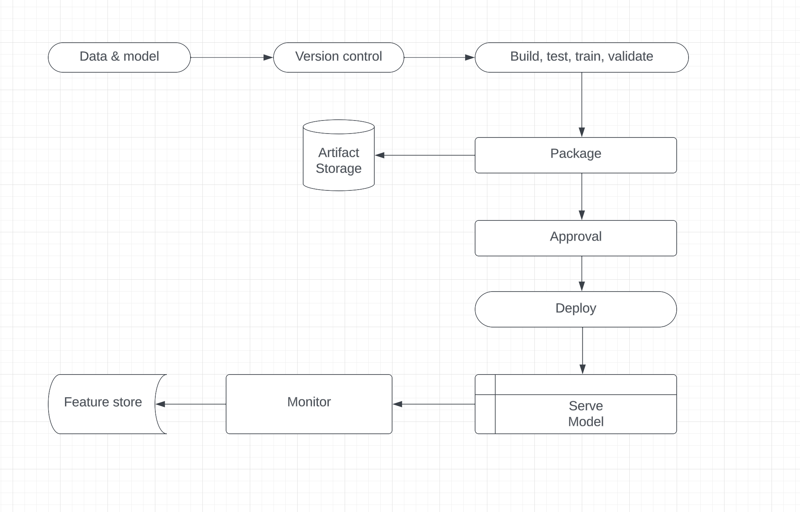

# Data and Backend Engineer Pariti Home assignment

This repository gives a summary of project structure, environment setup, and the entire process of data engineering from data ingestion to model deployments. The structure of the project has been well outlined. Please take some time to look into different components like data ingestion and data transformation.

## Disclaimer
1. The project lacks proper implementation of `read_candidates_from_airtable`
2.  The following project has an empty candidates.csv with only one sample of the candidate record

## Important Steps 
#### Data ingestion
The process of reading data from let's say database or any other file location.
#### Data transformation
The process of converting, cleaning, and structuring data in a usable format.
#### Model training
The process of training our data set.
#### Model evaluation
We can use different metrics or algorithms and choose the best metric
#### Model deployments
 Setting up CI/CD with GitHub actions
 or Setup CI/CD with Circle CI

## Project folder structure
.github  

artifacts  

logs  

notebook  

src  
		components  
			`__init__.py`  
			`data_ingestion.py`  
			`data_tranformation.py`  
			`model_training.py`  
		pipeline  
			`__init__.py`  
			`train_pipeline.py`  
			`predict_pipeline.py`  
		`__init__.py`  
		`logger.py`  
		`exception.py`  
		`utils.py`  
  
tests  

`app.py`  

`setup.py`  

`requirements.txt`  
		

- .github - Contains a YAML workflow that automates tasks such as building, testing, and deploying your code. We can replace this with .circleci if we want to use circle CI for CI/CD
- artifacts - For this assignment this is where we store our artifacts. raw, train, and test data. We also store our model, processor, and our encodings here. This is but a simple project explanation but for a production-level model we store this in artifact storage as outlined below in our CI/CD deployment pipeline.
- logs - For this assignment where we store our logs for different actions performed but in a production-level application we can use elastic stalk for logging
- notebook - This is where we do our exploratory data analysis (EDA). Find patterns in data, verify hypotheses, detect anomalies, and complete other tasks.
- src - Here we convert our jupyter notebook model code into a usable modular code and start serving the model as outlined in our deployment pipeline
	- components folder - Includes some important steps like data ingestion and data transformation if there is any need to perform these steps.
	- pipeline folder - Has training and prediction pipelines if needed
- tests - Contains a simple sample test. This can be improved in the future.
- `app.py` - The entry point of serving our model

## ML Deployment in AWS using CI/CD Pipelines

As outlined in the diagram above will be our steps to achieve a proper ML deployment and each tool for each step is also stated.

1. **Data & Model:**
    Prepare data. Develop and train the ML model using the prepared data.
    - **Tool:** Jupyter Notebooks for data exploration and model development.
2. **Version Control:**
     Keep track of changes to your code, data, and models over time. 
    - **Tool:** Git 
3. **Build, Test, Train, Validate:**
    - **Explanation:** Build and test your ML model.
    - **Tool:** Github actions/ Circle ci
4. **Package:**
    Package your trained model and its dependencies into a format that can be easily deployed.
    - **Tool:** Docker
5. **Artifact Storage:**
    Store the packaged model and other artifacts in a secure and accessible location.
    - **Tool:** AWS S3
6. **Approval:*
    Obtain necessary approvals before deploying the model to production.
    - **Tool:** Github workflow
7. **Deploy:**
    Deploy the packaged model to a production environment where it can be accessed by users or other systems.
    - **Tool:** Kubernetes for container orchestration or cloud platforms like AWS SageMaker
8. **Serving Model:**
    Set up a system for serving your machine learning model, making predictions or classifications based on new input.
    - **Tool:** Flask or FastAPI for creating API endpoints to serve the model.
9. **Monitor:**
    Keep an eye on the deployed model's performance in real-time, ensuring it continues to meet expectations and catching any issues.
    - **Tool:** Prometheus for monitoring metrics and Grafana for visualization.
10. **Feature Store:**
    Create a centralized repository for storing and managing features used by your machine learning models.
    
    ## Cloud service
    As clearly stated above I have opted to use AWS cloud service. AWS ML deployment has other strengths over other cloud services that have not been asked in the assignment. Like;
    Community, Clear documentation, and a wide range of services.
    
    But using the scenarios this is how I arrived at AWS. I did not consider Azure because I am not familiar with it.
    
    For both scenarios, I think it's fair to say both services have a win in cost and computational resources because they both employ serveless. In terms of Scalability, I would choose AWS for its auto-scaling capabilities. These and other reasons make AWS the suitable cloud service for our ML deployment
    
    #### AWS:
	- **Strengths:**
	    - Cost-effective with options like AWS Lambda for serverless computing.
	    - Scalability using Auto Scaling for adjusting resources based on demand.
	    - Comprehensive services like S3 for storage and AWS Glue for ETL.
	#### GCP:
	- **Strengths:**
	    - Google Cloud Functions for serverless execution.
	    - BigQuery for scalable and cost-effective data analysis.
	    - TensorFlow integration for machine learning tasks.

## Future Improvements
1. Use proper artifact storage such as an S3 bucket.
2. Implement effective logging mechanisms like Elastic Stack.
3. Employ automated training with tools like SageMaker.
4. Develop comprehensive tests for each step in the process.
